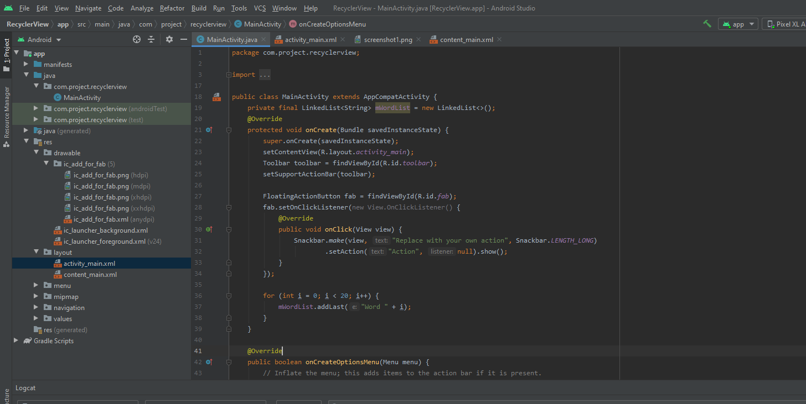
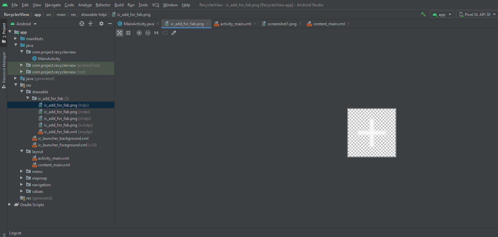

RecyclerView
======================
## TASK 1
### task to finish
========================
#### Select basic activity template and run the app.

<h6>create a LinkedList of 20 word strings that end in increasing numbers, and Add code within the onCreate method that populates mWordList with words.</h6>

<h6>create a fab add icon within a drawable folder</h6>

<h6>change the icon in floating action button.</h6>

=================================================================================================
