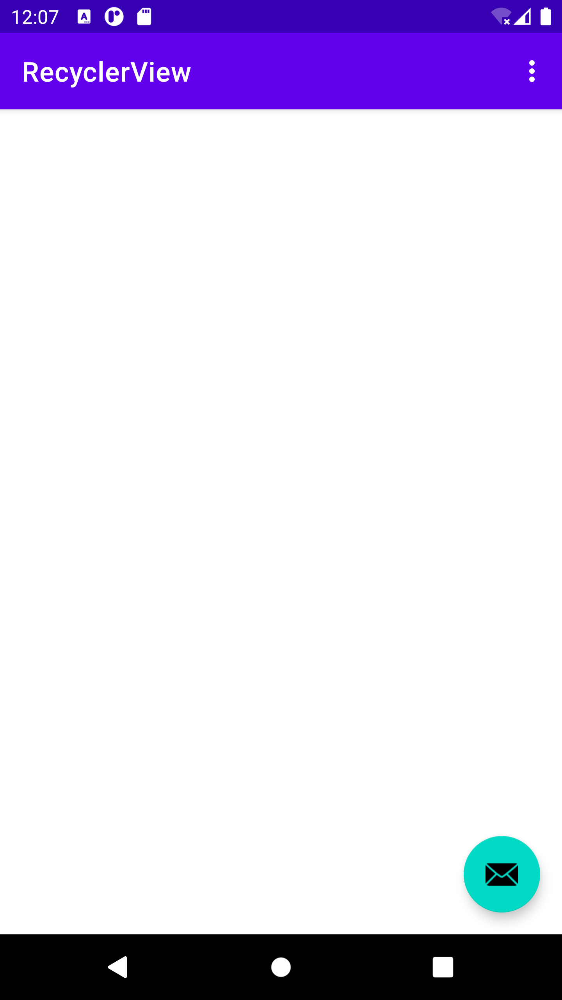

RecyclerView
======================
### TASK 1
#### task to finish
========================
  - Select basic activity template and run the app.
	 
  -  create a LinkedList of 20 word strings that end in increasing numbers, as in ["Word 1", "Word 2", "Word 3", .... ] and Add code within the onCreate() method that populates mWordList with words.
	 
  - create a fab add icon within a drawable folder
	 
  - change the icon in floating action button.
  	 

=================================================================================================